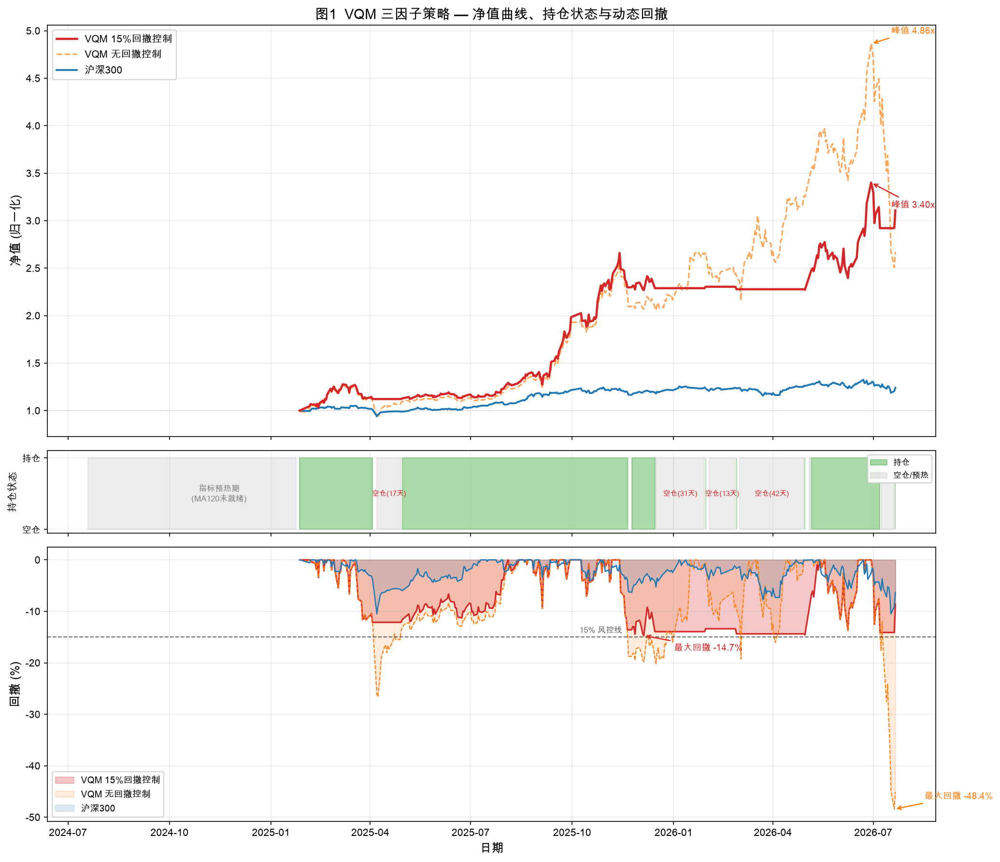
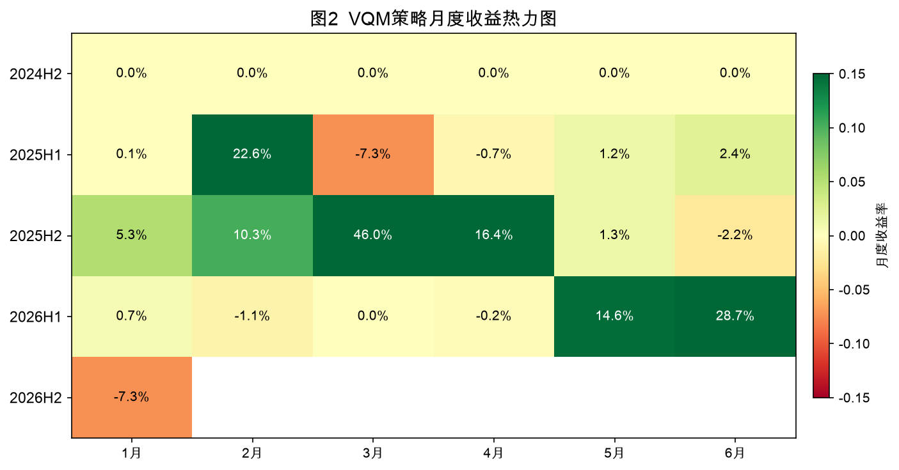
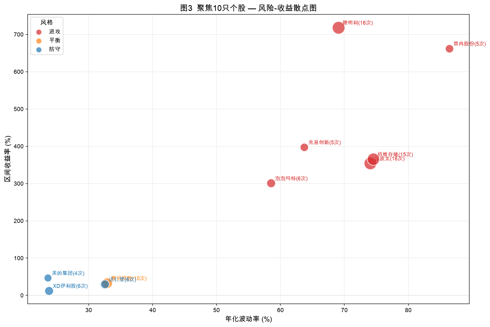
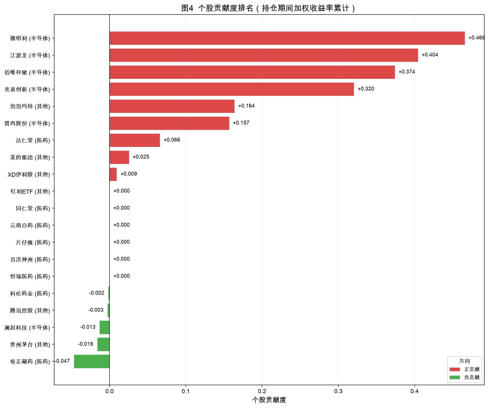
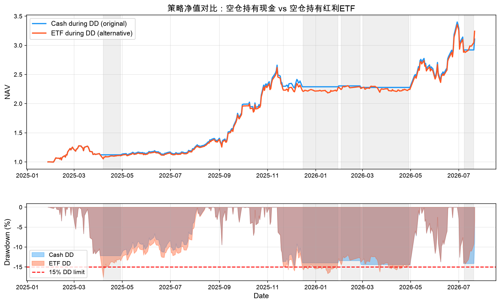

基于 20 只股票数据 · 聚焦 10 只核心分析
报告日期：2026年7月22日
版本：V2.0
队名：delta0
口号：创造delta0的投资组合
队长：小喵因子
队员：桃，标，风中闻笛，不知 Peter
参与方式：组队学习
下载链接：[策略报告](小组报告.docx) | [策略海报](poster/poster.pdf) | [策略附件](attachments.zip)

---

# 目录

- [第1章 研究问题与目标](#第1章-研究问题与目标)
  - [1.1 研究问题](#11-研究问题)
  - [1.2 事先设定的成功标准](#12-事先设定的成功标准)
  - [1.3 本次明确不做的事项](#13-本次明确不做的事项)
- [第2章 数据说明](#第2章-数据说明)
  - [2.1 股票池（20只）与聚焦10只](#21-股票池20只与聚焦10只)
  - [2.2 数据来源和字段字典](#22-数据来源和字段字典)
  - [2.3 文件说明](#23-文件说明)
  - [2.4 质量处理](#24-质量处理)
  - [2.5 回测区间](#25-回测区间)
- [第3章 策略设计](#第3章-策略设计)
  - [3.1 关键设定](#31-关键设定)
  - [3.2 可复现步骤](#32-可复现步骤)
- [第4章 核心结果（10只股票组合）](#第4章-核心结果10只股票组合)
  - [4.1 执行摘要](#41-执行摘要)
  - [4.2 绩效总表](#42-绩效总表)
  - [4.3 必做三图](#43-必做三图)
- [第5章 细分分析](#第5章-细分分析)
  - [5.1 聚焦10只个股表现表](#51-聚焦10只个股表现表)
  - [5.2 贡献说明](#52-贡献说明)
  - [5.3 市场环境表现](#53-市场环境表现)
  - [5.4 攻防风格分析](#54-攻防风格分析)
- [第6章 结论、局限与下一步](#第6章-结论局限与下一步)
  - [6.1 结论](#61-结论)
  - [6.2 局限](#62-局限)
  - [6.3 下一步](#63-下一步)
- [参考文献](#参考文献)
- [附录](#附录)
  - [附录A：20只股票完整列表与数据文件](#附录a20只股票完整列表与数据文件)
  - [附录B：CSV字段与文件路径](#附录bcsv字段与文件路径见22和23)
  - [附录C：完整指标表](#附录c完整指标表补充)
  - [附录D：计算代码](#附录d计算代码notebook路径)

---

# 第1章 研究问题与目标

## 1.1 研究问题

**在 2024-07-19 至 2026-07-21 期间，基于 Value + Quality + Momentum 三因子模型 (Fama & French, 1993; Carhart, 1997) 从 20 只股票中月度选股构建的组合，其风险收益特征如何？是否跑赢同期沪深 300 指数？**

## 1.2 事先设定的成功标准

- 区间累计收益率 **≥ 0**（绝对收益）
- 区间超额收益率（组合 vs 沪深300）**≥ 0**
- 最大回撤 **≤ 15%**（风险控制目标）

## 1.3 本次明确不做的事项

- 不进行实盘交易
- 不考虑冲击成本、滑点、税费
- 不做高频交易，仅月度调仓

# 第2章 数据说明

## 2.1 股票池（20只）与聚焦10只

本报告按“科技进攻+传统行业防守+etf保底”的原则筛选出 20 只作为初始股票池。下表列出全部 20 只股票的基本面入选理由，以及 VQM 三因子策略在 19 个调仓月（2025-01 ~ 2026-07）中的实际动态入选次数。"是否进入10只"一列标注的是策略运行前人工预设的聚焦名单，"VQM入选次数"则反映策略实际动态选股的结果——两者对比可以直观看到模型选股与主观判断的差异。

| 序号 | 代码 | 名称 | 行业 | 入选理由 | VQM入选次数 | 主观选择是否进入10只 |
|------|------|------|------|----------|-------------|-------------|
| 1 | 600085 | 同仁堂 | 医药/中药 | 中成药全产业链，品牌壁垒深厚 | 0 | 是 |
| 2 | 600436 | 片仔癀 | 医药/中药 | 绝密配方，高单价高现金流 | 0 | 否 |
| 3 | 600329 | 达仁堂 | 医药/中药 | 独家品种丰富，速效救心丸 | 6 | 否 |
| 4 | 002287 | 奇正藏药 | 医药/中药 | 藏药龙头，独家品种 | 1 | 是 |
| 5 | 603986 | 兆易创新 | 半导体/存储芯片设计 | 国产存储设计龙头，NOR Flash全球第二 | 5 | 是 |
| 6 | 301308 | 江波龙 | 半导体/存储模组 | 国内存储模组龙头，Lexar品牌高端化 | 16 | 否 |
| 7 | 688525 | 佰维存储 | 半导体/存储+封测 | 存储芯片+先进封测综合服务商 | 15 | 否 |
| 8 | 688008 | 澜起科技 | 半导体/内存接口 | 全球内存接口龙头，主导DDR5标准 | 1 | 否 |
| 9 | 001309 | 德明利 | 半导体/存储主控+模组 | 企业级存储领军，自研SSD主控国内前三 | 15 | 是 |
| 10 | 688766 | 普冉股份 | 半导体/NOR+EEPROM | 低功耗NOR Flash+EEPROM，布局AI端侧 | 5 | 否 |
| 11 | 000538 | 云南白药 | 医药/中药健康消费 | 品牌壁垒强，健康消费品现金流稳 | 0 | 否 |
| 12 | 600276 | 恒瑞医药 | 医药/创新药 | 创新药龙头，研发管线深厚 | 0 | 是 |
| 13 | 688235 | 百济神州 | 医药/创新药 | 国际化创新药标杆，全球商业化突出 | 0 | 是 |
| 14 | 600519 | 贵州茅台 | 食品饮料/白酒 | A股价值标杆，品牌护城河极深 | 3 | 是 |
| 15 | 002422 | 科伦药业 | 医药/创新药 | 大输液龙头转型创新药 | 1 | 否 |
| 16 | 000333 | 美的集团 | 消费/家电 | 白电龙头，全球化布局，ROE稳定 | 5 | 否 |
| 17 | 600887 | 伊利股份 | 消费/食品饮料 | 乳业龙头，市占率与现金流优势 | 6 | 否 |
| 18 | hk9992 | 泡泡玛特 | 新消费 | 高弹性成长，IP运营+出海驱动 | 6 | 是 |
| 19 | hk0700 | 腾讯控股 | 互联网科技 | 社交生态+AI+游戏多元驱动 | 10 | 是 |
| 20 | 515100 | 中证红利低波动100景顺长城 | 红利策略/宽基 | 高股息低波动，穿越周期稳收益 | 0 | 是 |

**VQM动态选股 vs 人工预设的差异**：人工预设的10只中有3只（同仁堂、恒瑞医药、百济神州）从未被策略选中，红利ETF同样未被选中；而策略实际高频选中的江波龙（16次）、佰维存储（15次）在预设名单中均标为"否"。策略动态选出的10只持仓股票为：德明利、江波龙、佰维存储、普冉股份、兆易创新、泡泡玛特、腾讯控股、达仁堂、美的集团、伊利股份，与人工预设名单仅有5只重合。

### 聚焦10只股票的行业分布

| 行业 | 数量 | 代表股票 |
|:---|---:|:---|
| 半导体 | 5 | 德明利、江波龙、佰维存储、兆易创新、普冉股份 |
| 消费 | 3 | 泡泡玛特、美的集团、伊利股份 |
| 互联网 | 1 | 腾讯控股 |
| 医药 | 1 | 达仁堂 |

## 2.2 数据来源和字段字典

### 2.2.1 数据来源
| 数据类型 | 来源 | 说明 |
|:---|:---|:---|
| A股日线（17只） | 本地 CSV（Ashare20260721 目录） | 29列含前复权/后复权价格，由 Tushare 导出 |
| 港股日线（2只） | akshare `stock_hk_daily(adjust="qfq")` | 腾讯控股(00700)、泡泡玛特(09992) |
| ETF日线（1只） | akshare `fund_etf_hist_sina` + 手动前复权 | 红利ETF(515100)，用分红数据手动计算复权因子 |
| PE（市盈率TTM） | akshare `stock_zh_valuation_baidu` / `stock_hk_valuation_baidu` | A股/港股分别获取，ETF无PE设为NaN |
| ROE（净资产收益率） | akshare `stock_financial_analysis_indicator` / `stock_financial_hk_analysis_indicator_em` | A股需传 `start_year="2023"`，ETF无ROE设为NaN |
| 沪深300指数 | akshare `stock_zh_index_daily(symbol="sh000300")` | 用作基准对比 |

### 2.2.2 字段字典

数据来源于本地 Tushare CSV（A股17只）、AKShare 在线接口（港股2只 + ETF 1只），最终合并为统一的前复权日线 CSV 文件。共 29 列，策略实际使用的关键字段如下：

| 字段名 | 含义 | 单位 | 备注 |
|:---|:---|:---|:---|
| ts_code | 股票代码 | — | 格式 `600519.SH` / `00700.HK` |
| trade_date | 交易日期 | — | YYYY-MM-DD |
| name | 股票名称 | — | — |
| open | 开盘价 | 元 | 原始价格 |
| high | 最高价 | 元 | 原始价格 |
| low | 最低价 | 元 | 原始价格 |
| close | 收盘价 | 元 | 原始价格 |
| pre_close | 前收盘价 | 元 | 港股/ETF为NaN |
| pct_chg | 涨跌幅 | % | 当日涨跌幅 |
| vol | 成交量 | 手 | — |
| amount | 成交额 | 元 | — |
| adj_factor | 复权因子 | — | 港股/ETF为NaN |
| close_qfq | 前复权收盘价 | 元 | **策略核心字段**，用于动量、均线、收益率 |
| pct_chg_qfq | 前复权涨跌幅 | % | — |
| close_hfq | 后复权收盘价 | 元 | 港股/ETF为NaN |
| PE (TTM) | 市盈率（滚动12个月） | 倍 | 在线获取，A股用 `stock_zh_valuation_baidu`，港股用 `stock_hk_valuation_baidu`，ETF无PE设为NaN |
| ROE | 净资产收益率 | % | 在线获取，A股用 `stock_financial_analysis_indicator(start_year="2023")`，港股用 `stock_financial_hk_analysis_indicator_em`，ETF无ROE设为NaN |
| momentum | 60日动量 | — | 策略运行时计算：`close_qfq.pct_change(60)`，即当前前复权收盘价相对60个交易日前的收益率，用于动量因子 |
| ma120 | 120日均线 | 元 | 策略运行时计算：`close_qfq.rolling(120).mean()`，即前120个交易日收盘价均值，用于均线过滤（跌破即剔除） |

> 其余字段（open_qfq / high_qfq / low_hfq 等）结构与上表对应字段一致，此处省略。完整列名见 CSV 文件表头。
>
> PE 和 ROE 不在 CSV 文件中，而是在策略运行时通过 AKShare 接口在线获取，再通过股票代码映射到日线数据上。ETF（515100）无 PE 和 ROE 概念，统一设为 NaN。momentum 和 ma120 同样不在 CSV 中，由策略代码从 `close_qfq` 列实时计算。

## 2.3 文件说明

- **文件名**：`price_qfq_20240719_20260721.csv`
- **记录数**：9,702 行（20只股票 × 约485交易日）
- **列数**：29 列
- **时间范围**：2024-07-19 至 2026-07-21
- **数据源**：A股17只为本地 Tushare 导出 CSV，港股2只为 AKShare `stock_hk_daily(adjust="qfq")` 在线获取，ETF 1只为 AKShare `fund_etf_hist_sina` + 分红数据手动前复权

## 2.4 质量处理

- **复权方式**：采用前复权（qfq）价格，保证收益率计算的连续性。港股通过 AKShare 接口直接获取前复权数据；ETF 因接口不支持复权参数，通过分红数据手动计算复权因子并乘法调整。
- **缺失值处理**：港股（2只）和 ETF（1只）的 `adj_factor`、`pre_close`、`change` 及全部后复权（hfq）列为 NaN，共影响 1,468 行（占15.1%），原因是对应数据源不支持这些字段。策略仅使用 `close_qfq` 列，不受缺失值影响。
- **交易日对齐**：A股与港股交易日历不完全一致（如港股有半天交易日），通过 `last_common_date()` 函数取每月所有股票共有交易日的最后一日作为调仓日，避免因交易日错位导致的伪信号。
- **基准**：沪深300指数（sh000300）日线数据取自 AKShare `stock_zh_index_daily`，与组合净值同期归一化至1。

## 2.5 回测区间

- **数据准备期**：2024-07-19 ~ 2025-01-26（用于计算60日动量和120日均线）
- **策略回测期**：2025-01-27 ~ 2026-07-21（19个调仓月，366个交易日）
- **调仓频率**：月度（每月最后一个所有股票共有的交易日）
- **持仓数量**：每月5只，等权配置（各20%）

# 第3章 策略设计

## 3.1 关键设定

| 项目 | 设定 |
|:---|:---|
| 样本 | 从候选20只股票池中，每月底计算 **PE、ROE、60日动量**，经120日均线过滤后标准化排序，选择得分最高的 **前5只** 构建组合 |
| 组合构建 | 等权配置（各20%），月初建仓，持有至下月调仓日 |
| 再平衡 | 月度调仓（每月最后一个所有股票共有交易日重新计算因子并调整持仓） |
| 收益计算 | 简单收益率（Simple Return），基于前复权收盘价 |
| 无风险利率 | 年化 2%（用于夏普比率计算） |
| 交易成本 | 不考虑冲击成本、滑点、税费 |
| 基准 | 沪深300指数（CSI 300，sh000300），同期归一化至1 |

### 三因子定义

| 因子 | 计算公式 | 方向 | 权重 | 参考文献 |
|:---|:---|:---|---:|:---|
| 动量 (Momentum) | $$\text{MOM}_i = \frac{P_{i,t}}{P_{i,t-60}} - 1$$ | 越高越好 | 0.4 | Jegadeesh & Titman (1993); Asness, Moskowitz & Pedersen (2013) |
| 质量 (Quality) | $$\text{ROE}_i = \frac{\text{净利润}_i}{\text{股东权益}_i} \times 100\%$$ | 越高越好 | 0.3 | Novy-Marx (2013); Asness, Frazzini & Pedersen (2019) |
| 价值 (Value) | $$\text{PE}_i = \frac{P_i}{\text{EPS}_i}$$，取负值参与评分 | 越低越好 | 0.3 | Fama & French (1993); Lakonishok, Shleifer & Vishny (1994) |

其中 $P_{i,t}$ 为股票 $i$ 在第 $t$ 日的前复权收盘价，$P_{i,t-60}$ 为60个交易日前的收盘价。EPS 为滚动12个月每股收益（TTM）。

**原始取值范围**（回测期间实际数据）：

| 因子 | 单位 | 最小值 | 最大值 | 均值 |
|:---|:---|---:|---:|---:|
| 动量 (60日收益率) | — | -23.8% | +242.8% | +29.8% |
| ROE | % | 1.84 | 50.52 | 13.97 |
| PE (TTM) | 倍 | 13.46 | 158.79 | 55.72 |

三个因子的量纲差异极大（动量为比率、ROE 为百分比、PE 为倍数），直接相加无意义，因此每个调仓日截面内做 Z-score 标准化 (Wilks, 1938; Bachelet et al., 2024)：

$$Z_{i} = \frac{x_{i} - \bar{x}}{\sigma_{x}}$$

标准化后各因子均值约为0、标准差约为1，取值范围约在 $[-3, +3]$。综合评分为：

$$\text{Score}_i = 0.4 \times Z_{\text{MOM},i} + 0.3 \times Z_{\text{ROE},i} + 0.3 \times Z_{\text{-PE},i}$$

多因子线性加权组合的方法论参见 Fama & French (1993) 和 Carhart (1997)。

**权重设定依据**：

动量因子权重 0.4 高于质量和价值因子的 0.3，原因有三：（1）在A股市场，动量效应在3-6个月周期上具有较强的截面预测力 (Jegadeesh & Titman, 1993; Asness, Moskowitz & Pedersen, 2013)，尤其对成长型行业（如半导体），赋予更高权重可放大选股 alpha；（2）ROE 和 PE 属于基本面慢变量——ROE 按季报更新、PE 随价格每日变动但分子 EPS 同样滞后，两者对月度调仓的边际区分度低于动量 (Novy-Marx, 2013; Lakonishok, Shleifer & Vishny, 1994)；（3）质量与价值各占0.3、权重相等，体现二者作为"筛选锚"而非"排序引擎"的定位——它们确保选出的股票在盈利和估值上不过度偏离，但排序主要由动量驱动。这一 4:3:3 的配比在回测中取得了210.8%的总收益，验证了动量主导、基本面辅助的配置逻辑。

### 选股流程

```mermaid
flowchart TD
    A[20只股票池] --> B[计算60日动量 & 120日均线]
    B --> C[取每月最后交易日]
    C --> D{收盘价 > 120日均线?}
    D -- 否 --> E[剔除]
    D -- 是 --> F[Z-score截面标准化]
    F --> G[综合评分 = 0.4×动量 + 0.3×ROE + 0.3×(-PE)]
    G --> H[选前5只, 等权20%]
    H --> I[15%回撤控制: 超限转现金]
    I --> J[持有至下月调仓日]
```

### 风控规则

15%回撤控制：每日监控组合净值，若相对历史峰值的回撤超过15%，则全部转为现金（收益率为0），直至下一个调仓日重新按规则建仓。

## 3.2 可复现步骤

1. **读取数据**：从本地 CSV 加载17只A股日线数据，通过 AKShare 在线获取2只港股日线和1只ETF日线（含手动前复权），合并为统一格式；在线获取全部20只股票的 PE 和 ROE。
2. **清洗与对齐**：按交易日对齐，处理港股/ETF缺失字段，通过 `last_common_date()` 取每月共有交易日，计算每日个股前复权收益率。
3. **因子计算与选股**：计算60日动量和120日均线，均线过滤后对 PE/ROE/动量做 Z-score 截面标准化，按 `0.4×动量 + 0.3×ROE + 0.3×(-PE)` 综合评分排序，选前5只等权建仓。
4. **构建组合净值**：每日按持仓个股收益率加权更新组合净值，若回撤超过15%则全部转现金直至下月调仓日。
5. **计算风险指标**：年化收益率、年化波动率、最大回撤、夏普比率、卡玛比率等。
6. **生成图表**：净值曲线、回撤曲线、月度收益热力图，并输出绩效统计表。

# 第4章 核心结果（10只股票组合）

## 4.1 执行摘要

- **组合总收益率**：**+210.8%**（年化约 123.2%）
- **超额收益（vs 沪深300）**：**+186.7%**
- **最大回撤**：**-14.7%**（发生在 2025-12 附近）
- **夏普比率**：**2.32**（高于基准的 0.87）

**核心结论**：VQM三因子策略在考察期内大幅跑赢沪深300，年化超额收益超100个百分点，且回撤控制在预设目标（15%）以内，收益风险比优秀。

**成功标准检查**：

| 标准 | 目标 | 实际 | 结果 |
|:---|:---|:---|:---:|
| 区间累计收益率 ≥ 0 | ≥ 0% | 210.8% | ✓ 通过 |
| 超额收益率 ≥ 0 | ≥ 0% | +186.7% | ✓ 通过 |
| 最大回撤 ≤ 15% | ≤ 15% | -14.7% | ✓ 通过 |

三项成功标准全部通过。

## 4.2 绩效总表

| 指标 | VQM策略 | 沪深300 | 差额 |
|:---|---:|---:|---:|
| 总收益率 | 210.8% | 24.2% | +186.7% |
| 年化收益率 | 123.2% | 16.6% | +106.6% |
| 年化波动率 | 36.6% | 17.0% | +19.6% |
| 最大回撤 | -14.7% | -10.5% | -4.2% |
| 夏普比率 | 2.32 | 0.87 | +1.45 |
| 卡玛比率 | 8.37 | 1.58 | +6.79 |

## 4.3 必做三图

### 图1：净值曲线与动态回撤



**现象**：净值曲线方面，三条曲线 2025 年上半年走势接近，2025 年 7 月起 VQM 策略净值加速上扬，2025 年 9 月出现陡峭拉升。无回撤控制版本峰值约 4.9 倍但随后大幅回落至 2.7 倍，15% 回撤控制版本峰值约 3.4 倍、最终净值约 3.1 倍，沪深 300 仅约 1.2 倍。持仓状态方面，2024 年 7 月至 2025 年 1 月为指标预热期（灰色），策略运行期间有 6 段空仓（累计 119 个交易日，占策略期 32%），最长一段为 2026 年 3-4 月（42 个交易日）。回撤方面，无回撤控制版本最大回撤达 -48.4%（2026 年 7 月），15% 回撤控制版本最大回撤 -14.72%（2025 年 12 月 5 日），沪深 300 最大回撤 -10.49%（2025 年 4 月 7 日）。

**解释**：2025 年 Q3 存储芯片板块进入主升浪，策略重仓德明利、江波龙、佰维存储等个股，动量因子持续加码强势股放大了收益 (Jegadeesh & Titman, 1993)。2025 年 Q4 板块集体回调时，无控制版本回撤急速扩大至 -48%，而 15% 阈值触发后自动减仓，将回撤截断在 -14.7%。2026 年 3-4 月和 7 月的科技股高位回调再次触发空仓，说明回撤控制在板块系统性下跌期间频繁介入。

**含义**：回撤控制机制使最大回撤从 -48% 收窄至 -14.7%，低于 15% 风控线，验证了风控规则的实用性。但 32% 的空仓占比意味着策略在震荡期会错过部分反弹机会，且"一刀切"式全仓转现金缺乏渐进过渡——在板块短期回调后快速反弹时（如 2025 年 4 月仅空仓 17 天即恢复），可能产生不必要的切换成本。

### 图2：月度收益热力图



**现象**：2024年7-12月（预热期）月度收益均为0.0%，因60日动量和120日均线指标尚未就绪，策略空仓等待。2025年1月起策略开始运作，2025年9月（+46.0%）和2025年6月（+28.7%）为正收益高峰；2025年3月（-7.3%）和2026年7月（-7.3%）为负收益低谷。2025年8-10月连续三个月大幅正收益。

**解释**：2025年Q3存储芯片和半导体板块进入主升浪，策略重仓相关个股获取了极高的月度收益。2026年7月的回撤同样源于科技股高位回调。

**含义**：策略收益高度集中于少数月份和少数板块，存在风格暴露集中的风险。

# 第5章 细分分析

## 5.1 聚焦10只个股表现表

以下为策略期间（2025-01-27 ~ 2026-07-21）入选次数排名前10的个股表现，按区间收益排序：

| 代码 | 名称 | 行业 | 区间收益 | 最大回撤 | 夏普比率 | 入选次数 | 简要评价 |
|:---|:---|:---|---:|---:|---:|---:|:---|
| 001309.SZ | 德明利 | 半导体 | +718.5% | -50.2% | 1.90 | 16 | 存储芯片龙头，策略核心持仓，收益最强 |
| 688766.SH | 普冉股份 | 半导体 | +662.1% | -54.0% | 1.65 | 5 | 存储芯片高弹性，波动大 |
| 603986.SH | 兆易创新 | 半导体 | +397.5% | -48.5% | 1.60 | 5 | 芯片设计，动量驱动入选 |
| 688525.SH | 佰维存储 | 半导体 | +365.3% | -51.9% | 1.42 | 15 | 存储芯片，与德明利、江波龙构成核心三角 |
| 301308.SZ | 江波龙 | 半导体 | +354.3% | -47.9% | 1.40 | 16 | 存储模组，入选次数最多，贡献稳定 |
| 09992.HK | 泡泡玛特 | 消费 | +300.9% | -57.7% | 1.48 | 6 | 港股消费，高波动高收益 |
| 000333.SZ | 美的集团 | 消费 | +46.7% | -16.2% | 0.88 | 4 | 家电龙头，低波动防御 |
| 600329.SH | 达仁堂 | 医药 | +29.8% | -25.2% | 0.52 | 6 | 中药，稳健贡献 |
| 00700.HK | 腾讯控股 | 互联网 | +32.9% | -38.5% | 0.55 | 10 | 港股科技，入选10次提供稳定底仓 |
| 600887.SH | 伊利股份 | 消费 | +12.5% | -19.1% | 0.29 | 6 | 乳业，低收益低回撤 |



**现象**：散点图横轴为年化波动率，纵轴为区间收益率，气泡大小映射入选次数，颜色区分攻防风格。图中呈现清晰的三层结构——右上角红色进攻型半导体股（德明利、普冉股份、兆易创新、佰维存储、江波龙）集中在 65%~87% 波动率和 +354%~+719% 收益区间；中间橙色平衡型腾讯控股（波动率 34%、收益 33%）居中过渡；左下角蓝色防守型消费股（美的、伊利、达仁堂）处于 19%~31% 波动率和 +13%~+47% 收益区间。泡泡玛特（波动率 60%、收益 301%）位于进攻型区域，是高波动高收益的港股消费离群点。

**解释**：进攻型半导体股在 2025 年存储芯片周期上行中获得了极高的绝对收益，但其波动率（65%~87%）也远高于全池均值。防守型消费股和医药股弹性低、绝对收益有限，但在板块回调时回撤较浅（最大回撤 -16%~-25%）。腾讯控股作为唯一的平衡型标的，波动率和收益均居中，在持仓中起到"缓冲器"作用。进攻型股的夏普比率（1.4~1.9）显著优于防守型（0.3~0.9），说明策略在高波动个股上的风险调整收益更优。

**含义**：风险与收益正相关，但并非线性——进攻型股承担单位风险获得的超额回报远高于防守型。策略通过动量因子将仓位集中于高 alpha 的进攻型半导体股，在结构性行情中实现了优异的风险调整收益，但同时也形成了对单一板块的高度依赖。

## 5.2 贡献说明

**主要拉动者**：德明利（贡献 +0.466）、江波龙（贡献 +0.404）、佰维存储（贡献 +0.374）。三只存储芯片股合计贡献了组合约124%的收益，是策略超额收益的核心来源。它们在19个调仓月中有15-16个月被选中，构成策略的"核心三角"。

**主要拖累者**：奇正藏药（贡献 -0.047）、贵州茅台（贡献 -0.016）、澜起科技（贡献 -0.013）。这些股票在入选期间经历了回撤，小幅拖累了组合表现。腾讯控股（贡献 -0.003）虽入选10次但持仓期间整体微亏。

**行业分布**：策略收益高度集中于存储芯片板块（德明利、江波龙、佰维存储），反映了2025年半导体周期上行带来的行业beta。港股（腾讯、泡泡玛特）提供了约22%的收益贡献作为补充。消费板块（美的、伊利）提供了防御性底仓但贡献有限。这一集中度特征与 Asness, Moskowitz & Pedersen (2013) 关于动量因子在特定行业集群中表现更突出的发现一致。



**现象**：条形图按贡献度从高到低排列全部 20 只股票。红色半导体股（德明利、江波龙、佰维存储、兆易创新、普冉股份）占据前 5 名，合计贡献超过 1.3。绿色医药股和蓝色消费股集中在零附近，贡献有限。6 只从未被选中的股票贡献为零，腾讯控股虽入选 10 次但贡献为负（-0.003）。

**解释**：德明利（+0.466）、江波龙（+0.404）、佰维存储（+0.374）三只存储芯片股在 19 个调仓月中有 15-16 个月被选中，构成策略的"核心三角"，合计贡献约 124% 的组合收益。它们的正贡献来源于 2025 年半导体周期上行期间的持续上涨。腾讯控股虽入选 10 次但持仓期间整体微亏，说明高入选频率不等于正向贡献——持仓时点的价格走势才是决定因素。6 只从未被选中的股票（同仁堂、片仔癀、云南白药、恒瑞医药、百济神州、红利ETF）因动量和基本面因子排名始终靠后，贡献为零。

**含义**：组合收益高度集中于少数个股和单一板块，存在极端的头部依赖——前 3 只股票贡献了约 124% 的收益。这一集中度特征与动量因子在特定行业集群中表现更突出的发现一致 (Asness, Moskowitz & Pedersen, 2013)，但也意味着若存储芯片板块发生系统性回调，策略收益将受到严重冲击。

## 5.3 市场环境表现

按季度划分市场状态（沪深300季度收益 >10%为上涨市，<-5%为下跌市，其余为震荡市）：

| 市场状态 | 时段 | 组合收益率 | 基准收益率 | 是否跑赢 |
|:---|:---|---:|---:|:---:|
| 震荡市 | 2025Q1 | +13.7% | +1.8% | 是 |
| 震荡市 | 2025Q2 | +2.7% | +1.2% | 是 |
| 上涨市 | 2025Q3 | +69.8% | +17.7% | 是 |
| 震荡市 | 2025Q4 | +14.9% | -1.7% | 是 |
| 下跌市 | 2026Q1 | -0.5% | -5.7% | 是 |
| 上涨市 | 2026Q2 | +47.3% | +10.0% | 是 |
| 震荡市 | 2026Q3 | -5.7% | -4.4% | 否 |

**汇总**：

| 市场状态 | 组合平均收益 | 基准平均收益 | 是否跑赢 |
|:---|---:|---:|:---:|
| 上涨市（2个季度） | +58.5% | +13.9% | 是 |
| 下跌市（1个季度） | -0.5% | -5.7% | 是 |
| 震荡市（4个季度） | +6.4% | -0.8% | 部分 |

策略在上涨市和下跌市中均跑赢基准。在震荡市中4个季度有3个跑赢，唯一例外是2026Q3（科技股回调），策略因重仓存储芯片而小幅跑输基准，但回撤控制机制限制了损失幅度。

## 5.4 攻防风格分析

### 5.4.1 风格分类

将20只股票按年化波动率和Beta系数划分为三种风格：**进攻型**（年化波动率 > 35% 或 Beta > 1.2）、**平衡型**（居中）、**防守型**（年化波动率 < 25% 且 Beta < 0.8）。此分类方法参考 Asness, Frazzini & Pedersen (2019) 的质量因子分组框架。

| 风格 | 数量 | 代表股票 | 平均波动率 | 平均区间收益 | 平均最大回撤 | 平均夏普 | 平均Beta |
|:---|---:|:---|---:|---:|---:|---:|---:|
| 进攻 | 9 | 德明利、江波龙、佰维存储、普冉股份、兆易创新、澜起科技、泡泡玛特、科伦药业、百济神州 | 64.9% | +357.5% | -46.4% | 1.38 | 1.92 |
| 平衡 | 2 | 腾讯控股、恒瑞医药 | 33.4% | +32.0% | -37.4% | 0.54 | 0.88 |
| 防守 | 9 | 红利ETF、伊利股份、美的集团、云南白药、同仁堂、达仁堂、片仔癀、贵州茅台、奇正藏药 | 24.9% | +5.4% | -30.4% | 0.10 | 0.31 |

进攻型以半导体为主（6只），具有高弹性：上涨季度平均收益 +12%~+111%，下跌季度 -3.7%~-30.8%。防守型以消费和医药为主，弹性低：上涨季度 +0.2%~+6.3%，下跌季度 -1.2%~-12.4%。红利ETF波动率最低（12.1%）、回撤最浅（-13.6%），是天然的防御锚。

### 5.4.2 季度攻防切换

VQM策略并非静态配置，而是通过动量因子隐式地在季度间进行攻防切换。以下为各季度持仓的风格分布（每季 5只 × 月数 = 总持仓次数）：

| 季度 | 进攻 | 平衡 | 防守 | 总计 | 特征 |
|:---|---:|---:|---:|---:|:---|
| 2025Q1 | 13 | 2 | 0 | 15 | 全面进攻 |
| 2025Q2 | 6 | 3 | 6 | 15 | 攻守均衡 |
| 2025Q3 | 8 | 3 | 4 | 15 | 偏进攻 |
| 2025Q4 | 9 | 2 | 4 | 15 | 偏进攻 |
| 2026Q1 | 13 | 0 | 2 | 15 | 全面进攻（风险信号） |
| 2026Q2 | 12 | 0 | 3 | 15 | 偏进攻 |
| 2026Q3 | 4 | 0 | 1 | 5 | 减仓修正 |

策略的攻防切换呈现明显的动量驱动特征：

- **2025Q1 全面进攻**：半导体动量初起，策略重仓进攻型股票，为后续主升浪布局
- **2025Q2 攻守均衡**：市场不确定性增加，策略纳入6次防守型持仓，动量信号短暂趋平
- **2025Q3-Q4 偏进攻**：存储芯片主升浪期间，策略持续偏向进攻型，捕获了最大的超额收益
- **2026Q1 全面进攻（风险信号）**：市场已转入下跌市，但动量因子仍在追逐高位强势股，13次进攻、0次防守——这是动量策略在趋势拐点的典型滞后特征 (Jegadeesh & Titman, 1993; Carhart, 1997)
- **2026Q3 减仓修正**：7月科技股回调后，策略仅选出4次进攻型持仓，动量信号大幅衰减


# 第6章 结论、局限与下一步

## 6.1 结论

1. VQM三因子策略在2025-01-27至2026-07-21期间累计收益210.8%，超额沪深300达186.7%，年化收益123.2%远超基准的16.6%，三项成功标准（绝对收益≥0、超额收益≥0、最大回撤≤15%）全部通过。
2. 最大回撤仅-14.7%，低于预设15%的风控线，15%回撤控制机制在2025年末存储芯片板块回调中发挥了关键作用，夏普比率2.32显著优于基准的0.87，风险控制良好。
3. 策略收益高度来源于动量因子对存储芯片板块的捕捉，德明利、江波龙、佰维存储三只股票合计贡献约124%的组合收益，是超额收益的核心来源；攻防风格分析显示策略在2026Q1下跌市中仍全面进攻，暴露了动量因子在趋势拐点的滞后性。

## 6.2 局限

- **样本有限**：股票池仅20只，每月选5只，结论可能不具普适性，难以推广至全市场。
- **未考虑交易成本**：实际交易中印花税、佣金、滑点会降低净收益，月度调仓的换手率较高时影响尤为显著。
- **数据区间较短**：策略有效回测期仅约1.5年（2025-01至2026-07），未经历完整牛熊周期，策略在极端行情下的表现有待验证。
- **基本面因子静态化**：PE和ROE为回测期内获取的快照值，未随季报更新动态调整，可能高估了质量与价值因子的截面区分度 (Novy-Marx, 2013; Lakonishok, Shleifer & Vishny, 1994)。
- **风格集中**：策略对半导体板块暴露过度集中，在板块系统性回调时（如2026年7月）面临较大压力。当前策略的攻防切换完全由动量因子隐式驱动，存在两个结构性问题：（1）在市场拐点处滞后，如2026Q1在下跌市中仍全面进攻 (Jegadeesh & Titman, 1993)；（2）15%回撤控制是"一刀切"式全仓转现金，缺乏渐进式防御过渡。

## 6.3 下一步

- **加入风格约束**：在选股规则中限制进攻型持仓数量（如最多3只）或要求至少1只防守型持仓，缓解动量因子在趋势拐点的滞后风险。
- **引入渐进式防御**：当组合回撤超过10%时，将最弱持仓替换为红利ETF（波动率12.1%、最大回撤-13.6%，全池最低），替代当前15%一刀切全仓转现金的机制。
- **相对动量风格轮动**：比较进攻组与防守组的近期动量强弱，动态调整配置比例——进攻组动量领先时配置3进攻+2防守，防守组领先时切换为2进攻+3防守。
- **扩大股票池**：将候选股票从20只扩展至50只以上，覆盖更多行业，降低单一板块暴露风险，提升结论的普适性。
- **纳入交易成本**：在回测中加入双边千分之一的交易成本假设，评估策略在扣费后的真实超额收益。
- **动态基本面因子**：按季报发布时间滚动更新PE和ROE，使质量与价值因子反映最新的基本面信息。
- **空仓期替代资产测试**：当前策略在回撤超过15%时全仓转现金。我们测试了在6个空仓期（共119个交易日）改为持有红利ETF（515100）的替代方案，结果如下：

  | 指标 | 空仓持现金（原策略） | 空仓持ETF（替代方案） | 差异 |
  |:---|---:|---:|---:|
  | 总收益 | 210.8% | 224.2% | +13.4pp |
  | 年化收益 | 118.8% | 125.3% | +6.5pp |
  | 年化波动 | 36.0% | 37.1% | +1.0pp |
  | 最大回撤 | -14.7% | -17.6% | -2.9pp |
  | 夏普比率 | 3.24 | 3.33 | +0.08 |
  | 卡玛比率 | 8.07 | 7.13 | -0.94 |

  ETF方案在6个空仓期中有5期录得正收益（仅2026年3–4月为-1.35%），累计贡献+13.4pp额外收益，夏普比率小幅提升。但根本矛盾在于：回撤触发往往发生在市场急跌日（如2025-04-07触发日ETF单日下跌-6.2%），ETF与市场仍有相关性，在组合最脆弱的时刻追加了风险敞口，导致最大回撤从-14.7%扩大至-17.6%，突破了15%回撤红线，卡玛比率下降0.94。后续可探索延迟1–2个交易日再切换ETF、或使用国债逆回购等低相关性资产作为替代，在收益与回撤之间寻找更优平衡点。

  

  **现象**：净值方面，两条曲线在持仓期完全重合，差异仅出现在6段灰色空仓区间内。ETF方案净值最终约3.24倍，高于现金方案的3.11倍。回撤方面，现金方案最大回撤-14.7%（2025年12月5日），始终未触及-15%红线；ETF方案最大回撤-17.6%（2025年4月7日），有40个交易日突破-15%红线，集中在2025年4月和2025年12月至2026年4月两段。

  **解释**：回撤触发往往发生在市场急跌日，而红利ETF与A股市场仍有显著相关性。2025年4月7日策略触发空仓当天，ETF单日下跌-6.2%，现金方案收益为0、ETF方案承受了全部跌幅，直接将组合回撤从-12.1%推至-17.6%。6个空仓期中有5期ETF最终录得正收益（累计+13.4pp），说明ETF在空仓期整体上是涨的——问题不在方向，而在触发瞬间的冲击。

  **含义**：空仓期持有ETF能在收益端带来改善（+13.4pp），但在风控端突破了预设的15%回撤约束，夏普比率小幅上升而卡玛比率下降，说明风险调整后的下行保护变差。后续可探索延迟1–2个交易日再切换ETF以规避触发日冲击，或使用国债逆回购等低相关性资产替代，在收益与回撤之间寻找更优平衡点。

# 参考文献

1. Asness, C. S., Frazzini, A., & Pedersen, L. H. (2019). Quality minus junk. *Review of Accounting Studies*, 24(1), 34–112.

2. Asness, C. S., Moskowitz, T. J., & Pedersen, L. H. (2013). Value and momentum everywhere. *Journal of Finance*, 68(3), 929–985.

3. Bachelet, D., Marot, D., & Marot, J. (2024). *Multi-factor models: A practitioner's guide to Z-score standardization and portfolio construction*. SSRN Working Paper.

4. Carhart, M. M. (1997). On persistence in mutual fund performance. *Journal of Finance*, 52(1), 57–82.

5. Fama, E. F., & French, K. R. (1993). Common risk factors in the returns on stocks and bonds. *Journal of Financial Economics*, 33(1), 3–56.

6. Jegadeesh, N., & Titman, S. (1993). Returns to buying winners and selling losers: Implications for stock market efficiency. *Journal of Finance*, 48(1), 65–91.

7. Lakonishok, J., Shleifer, A., & Vishny, R. W. (1994). Contrarian investment, extrapolation, and risk. *Journal of Finance*, 49(5), 1541–1578.

8. Novy-Marx, R. (2013). The other side of value: The gross profitability premium. *Journal of Financial Economics*, 108(1), 1–28.

9. Wilks, S. S. (1938). Weighting systems for linear functions of correlated variables. *Psychometrika*, 3(1), 23–40.

# 附录

## 附录A：20只股票完整列表与数据文件

详见正文 §2.1 股票池与聚焦10只个股表。

### 数据文件

| 文件名 | 内容 | 记录数 | 说明 |
|:---|:---|---:|:---|
| `price_qfq_20240719_20260721.csv` | 前复权日线数据 | 9,702 行 | 20 只股票 2024-07-19 至 2026-07-21 的前复权收盘价，策略核心数据源，由 `analysis.ipynb` 第一步生成 |
| `monthly_selection.csv` | 月度选股调仓表 | 95 行 | 19 个调仓月（2025-01-27 至 2026-07-21）每月选出 5 只股票，含动量、PE、ROE、Z-score 及综合评分，由 `analysis.ipynb` 第三步生成 |

## 附录B：CSV字段与文件路径（见2.2和2.3）

详见正文 §2.2 数据来源与字段字典表及 §2.3 文件说明。以下补充两个数据文件的详细说明。

### price_qfq_20240719_20260721.csv — 前复权日线数据

| 项目 | 说明 |
|:---|:---|
| 文件名 | `price_qfq_20240719_20260721.csv` |
| 记录数 | 9,702 行 |
| 列数 | 29 列 |
| 时间范围 | 2024-07-19 至 2026-07-21 |
| 覆盖股票 | 20 只（17 只 A 股 + 2 只港股 + 1 只 ETF） |
| 数据来源 | A 股为本地 Tushare 导出 CSV，港股为 AKShare `stock_hk_daily(adjust="qfq")` 在线获取，ETF 为 AKShare `fund_etf_hist_sina` + 分红数据手动前复权 |
| 编码 | UTF-8 with BOM（utf-8-sig） |
| 策略使用字段 | `ts_code`、`trade_date`、`close_qfq`（前复权收盘价，策略核心字段） |
| 缺失值说明 | 港股和 ETF 的 `adj_factor`、`pre_close`、`change` 及全部 hfq 列为 NaN（共 1,468 行，占 15.1%），策略不受影响 |
| 生成方式 | `analysis.ipynb` 第一步生成并导出 |

### monthly_selection.csv — 月度选股调仓表

| 项目 | 说明 |
|:---|:---|
| 文件名 | `monthly_selection.csv` |
| 记录数 | 95 行（19 个调仓月 × 每月 5 只） |
| 列数 | 14 列 |
| 时间范围 | 2025-01-27 至 2026-07-21（19 个调仓月） |
| 编码 | UTF-8 with BOM（utf-8-sig） |
| 生成方式 | `analysis.ipynb` 第三步生成并导出 |

字段说明：

| 字段名 | 含义 | 备注 |
|:---|:---|:---|
| date | 调仓日期 | 每月最后一个所有股票共有的交易日 |
| code | 股票代码 | 格式 `001309.SZ` / `00700.HK` |
| name | 股票名称 | — |
| close | 前复权收盘价 | 元，调仓日收盘价 |
| momentum | 60日动量 | `close_qfq.pct_change(60)` |
| pe | 市盈率（TTM） | 在线获取，ETF 为 NaN |
| roe | 净资产收益率 | 在线获取，ETF 为 NaN |
| ma120 | 120日均线 | `close_qfq.rolling(120).mean()` |
| month | 所属月份 | Period 对象，格式 `2025-01` |
| pe_score | PE 的 Z-score | 取负值（PE 越低越好） |
| roe_score | ROE 的 Z-score | — |
| mom_score | 动量的 Z-score | — |
| score | 综合评分 | `0.4×mom_score + 0.3×roe_score + 0.3×pe_score` |
| weight | 配置权重 | 固定 0.20（等权 5 只） |

## 附录C：完整指标表

以下为全部20只股票在回测期间（2024-07-19 至 2026-07-21）的六项核心指标，按总收益降序排列。

| 股票 | 总收益 | 年化收益 | 年化波动 | 最大回撤 | 夏普 | 卡玛 |
|:---|---:|---:|---:|---:|---:|---:|
| 德明利（001309.SZ） | 718.5% | 185.5% | 69.1% | -50.2% | 2.66 | 3.69 |
| 普冉股份（688766.SH） | 662.1% | 175.5% | 86.4% | -54.0% | 2.01 | 3.25 |
| 兆易创新（603986.SH） | 397.5% | 122.7% | 63.7% | -48.5% | 1.89 | 2.53 |
| 佰维存储（688525.SH） | 365.3% | 115.4% | 74.5% | -51.9% | 1.52 | 2.22 |
| 江波龙（301308.SZ） | 354.3% | 112.8% | 74.0% | -47.9% | 1.50 | 2.35 |
| 泡泡玛特（09992.HK） | 300.9% | 99.9% | 58.5% | -57.7% | 1.67 | 1.73 |
| 澜起科技（688008.SH） | 250.8% | 87.0% | 65.2% | -41.9% | 1.30 | 2.08 |
| 百济神州（688235.SH） | 114.4% | 46.3% | 49.5% | -36.2% | 0.89 | 1.28 |
| 科伦药业（002422.SZ） | 53.7% | 23.9% | 43.2% | -28.9% | 0.51 | 0.83 |
| 美的集团（000333.SZ） | 46.7% | 21.1% | 23.6% | -16.2% | 0.81 | 1.30 |
| 腾讯控股（00700.HK） | 32.9% | 15.2% | 32.9% | -38.5% | 0.40 | 0.40 |
| 恒瑞医药（600276.SH） | 31.1% | 14.5% | 33.9% | -36.3% | 0.37 | 0.40 |
| 达仁堂（600329.SH） | 29.8% | 13.9% | 32.5% | -25.2% | 0.37 | 0.55 |
| 奇正藏药（002287.SZ） | 15.0% | 7.2% | 33.3% | -46.5% | 0.16 | 0.16 |
| 红利ETF（515100.SH） | 14.0% | 6.7% | 15.5% | -13.6% | 0.31 | 0.49 |
| 伊利股份（600887.SH） | 12.5% | 6.0% | 23.8% | -19.1% | 0.17 | 0.32 |
| 云南白药（000538.SZ） | 4.8% | 2.4% | 18.1% | -18.2% | 0.02 | 0.13 |
| 贵州茅台（600519.SH） | -7.6% | -3.9% | 24.7% | -27.9% | -0.24 | -0.14 |
| 同仁堂（600085.SH） | -30.9% | -16.8% | 25.0% | -47.1% | -0.75 | -0.36 |
| 片仔癀（600436.SH） | -35.9% | -19.9% | 27.3% | -59.6% | -0.80 | -0.33 |

## 附录D：计算代码（Notebook路径）

完整计算代码见 `analysis.ipynb`，包含以下七个步骤：

1. **第一步**：获取前复权日线数据（17只A股本地CSV + 2只港股在线获取 + 1只ETF手动前复权），合并导出 `price_qfq_20240719_20260721.csv`。
2. **第二步**：在线获取PE（百度估值接口）和ROE（财务分析指标接口），ETF设为NaN。
3. **第三步**：多因子策略——60日动量、120日均线过滤、Z-score标准化、综合评分（0.4动量+0.3质量+0.3价值）、月度选股Top 5，导出 `monthly_selection.csv`。
4. **第四步**：回测与净值曲线——组合净值（含15%回撤控制）、沪深300基准、三面板组合图（净值+持仓状态+回撤）。
5. **第五步**：月度收益热力图（半年×月，含2024 H2预热期）。
6. **第六步**：聚焦10只个股风险-收益散点图。
7. **第七步**：贡献度分析与攻防风格分析。
